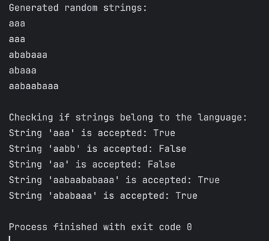

# Laboratory Work 1

### Course: Formal Languages & Finite Automata
### Author: Ciprian Moisenco

----

## Theory
In this laboratory work we had to implement a finite automaton.The finite automaton is a simple machine that can be in one of a finite number of states and can transition from one state to another based on input.

A finite automaton has a set of states, a set of input symbols, a transition function that maps a state and input symbol to a new state, a start state, and a set of accept states. When given an input string, the finite automaton reads the input symbol by symbol and transitions from state to state according to the rules.
## Objectives:
1. Understand what a language is and what it needs to have in order to be considered a formal one.


2. Provide the initial setup for the evolving project that I will work on during this semester. Basically I need to do the following:
    - Create a local && remote repository of a VCS hosting service;
    - Choose a programming language;
    - Create a separate folder where I will be keeping the report;


3. According to my variant number (by universal convention it is register ID), get the grammar definition and do the following tasks:
   - Implement a type/class for your grammar;
   - Add one function that would generate 5 valid strings from the language expressed by your given grammar;
   - Implement some functionality that would convert and object of type Grammar to one of type Finite Automaton;
   - For the Finite Automaton, please add a method that checks if an input string can be obtained via the state transition from it;

## Implementation description

### 1. `generate_string()` function

The `generate_string()` function generates a random string based on the production rules of the grammar. It starts with the start symbol and iteratively replaces non-terminal symbols with their corresponding productions until the string consists solely of terminal symbols. This function is useful for generating valid strings that belong to the language defined by the grammar.
```python
    def generate_string(self):
        string = self.start_symbol
        while any(v in string for v in self.vn):
            for v in string:
                if v in self.vn:
                    string = string.replace(v, random.choice(self.p[v]), 1)
                    break
        return string
```

### 2. `to_finite_automaton()` function

The `to_finite_automaton()` function converts the regular grammar into a finite automaton. It constructs the states, alphabet, transitions, and final states based on the grammar's production rules. The function maps each production rule to a transition in the automaton, ensuring that terminal symbols lead to the final state `(qf)`. This conversion allows the grammar to be represented as a finite automaton, which can then be used to recognize strings in the language.
```python
    def to_finite_automaton(self):
        states = self.vn | {'qf'}  #q
        alphabet = self.vt #sigma
        start_state = self.start_symbol #delta
        transitions = {} #q0
        final_states = {'qf'}  #F

        for key in self.p:
            for rule in self.p[key]:
                if (key, rule[0]) not in transitions:
                    transitions[(key, rule[0])] = set()

                if len(rule) == 1 and rule in self.vt:
                    transitions[(key, rule)].add('qf')  # terminal leads to final state
                elif len(rule) > 1:
                    next_state = rule[1] if rule[1] in self.vn else 'qf'
                    transitions[(key, rule[0])].add(next_state)

        return FiniteAutomaton(states, alphabet, transitions, start_state, final_states)
```

### 3. `string_in_language()` function

The `string_in_language()` function checks whether a given input string belongs to the language recognized by the finite automaton. It processes the string symbol by symbol, transitioning between states based on the automaton's transition rules. If the automaton reaches a final state after processing the entire string, the function returns `True`, indicating that the string is accepted by the automaton. Otherwise, it returns `False`.
```python

    def string_in_language(self, input_string):
        current_states = {self.start_state} 

        for symbol in input_string:
            next_states = set()
            for state in current_states:
                if (state, symbol) in self.transitions:
                    next_states.update(self.transitions[(state, symbol)])
            if not next_states:
                return False 
            current_states = next_states  

        return bool(current_states & self.final_states)  # check if any state is final
```

### 4. Testing Part

The implementation is tested by generating five random strings using the grammar and checking whether predefined test strings are accepted by the finite automaton. The output demonstrates how the generated strings conform to the defined grammar and validates the correctness of the finite automaton’s acceptance mechanism.
```python
# Main 
grammar = Grammar()
finite_automaton = grammar.to_finite_automaton()

print("Generated random strings:")
for _ in range(5):
    print(grammar.generate_string())

print("\nChecking if strings belong to the language:")
test_strings = ["aaa", "aabb", "aa", "aabaababaaa", "ababaaa"]
for s in test_strings:
    print(f"String '{s}' is accepted: {finite_automaton.string_in_language(s)}")
```


## Conclusion
This implementation illustrates the connection between regular grammars and finite automata. It demonstrates how a grammar can be systematically converted into an automaton and used for language recognition. The results confirm that the finite automaton correctly validates input strings based on the given grammar rules.

### Results as code:
```python
Generated random strings:
aaa
aaa
ababaaa
abaaa
aabaabaaa

Checking if strings belong to the language:
String 'aaa' is accepted: True
String 'aabb' is accepted: False
String 'aa' is accepted: False
String 'aabaababaaa' is accepted: True
String 'ababaaa' is accepted: True

Process finished with exit code 0
```
### Results as screenshot:


## References
1. COJUHARI Irina, DUCA Ludmila, FIODOROV Ion. "Formal Languages and Finite Automata: Guide for practical lessons". Technical University of Moldova.
2. Presentation "Regular Language. Finite Automata" - TUM - https://drive.google.com/file/d/1rBGyzDN5eWMXTNeUxLxmKsf7tyhHt9Jk/view