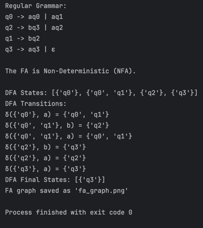
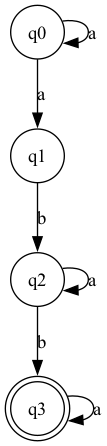

# Laboratory Work 2

### Course: Formal Languages & Finite Automata
### Author: Ciprian Moisenco

----

## Theory
A finite automaton is a mechanism used to represent processes of different kinds. It can be compared to a state machine as they both have similar structures and purpose as well. The word finite signifies the fact that an automaton comes with a starting and a set of final states. In other words, for process modeled by an automaton has a beginning and an ending.

Based on the structure of an automaton, there are cases in which with one transition multiple states can be reached which causes non determinism to appear. In general, when talking about systems theory the word determinism characterizes how predictable a system is. If there are random variables involved, the system becomes stochastic or non deterministic.

That being said, the automata can be classified as non-/deterministic, and there is in fact a possibility to reach determinism by following algorithms which modify the structure of the automaton.
## Objectives:
1. Understand what an automaton is and what it can be used for.

2. Continuing the work in the same repository and the same project, the following need to be added:

   a. Provide a function in your grammar type/class that could classify the grammar based on Chomsky hierarchy;

   b. For this you can use the variant from the previous lab;

3. According to your variant number, get the finite automaton definition and do the following tasks:

   a. Implement conversion of a finite automaton to a regular grammar;

   b. Determine whether your FA is deterministic or non-deterministic;

   c. Implement some functionality that would convert an NDFA to a DFA.

   d  . Represent the finite automaton graphically:

   -  You can use external libraries, tools or APIs to generate the figures/diagrams.

   -  Your program needs to gather and send the data about the automaton and the lib/tool/API return the visual representation.

## Implementation description

### 1. `classify_grammar()` function in the previous laboratory work.

The `classify_grammar` function determines the type of a grammar based on its production rules, classifying it according to the **Chomsky hierarchy**. It checks whether the grammar is **regular (Type 3), context-free (Type 2), context-sensitive (Type 1), or unrestricted (Type 0).** The function iterates through all production rules and evaluates them against specific conditions for each grammar type. For example, it checks if rules are of the form `A → a` or `A → aB` for regular grammars, or if the left-hand side is a single non-terminal for context-free grammars. If a rule violates the constraints of a higher-level type, the function downgrades the classification accordingly. After that, it returns the highest-level classification that the grammar satisfies.
```python
        def classify_grammar(self):
        is_regular = True
        is_context_free = True
        is_context_sensitive = True

        for lhs, rhs_list in self.p.items():
            for rhs in rhs_list:
                # Check if the grammar is regular
                if not (len(rhs) == 1 and rhs in self.vt) or \
                   (len(rhs) == 2 and rhs[0] in self.vt and rhs[1] in self.vn):
                    is_regular = False

                # Check if the grammar is context-free
                if not (len(lhs) == 1 and lhs in self.vn):
                    is_context_free = False

                # Check if the grammar is context-sensitive
                if not (len(lhs) <= len(rhs)):
                    is_context_sensitive = False

        if is_regular:
            return "Type 3 (Regular Grammar)"
        elif is_context_free:
            return "Type 2 (Context-Free Grammar)"
        elif is_context_sensitive:
            return "Type 1 (Context-Sensitive Grammar)"
        else:
            return "Type 0 (Unrestricted Grammar)"
```

### 2. `fa_to_regular_grammar(Q, sigma, delta, F)`

The `fa_to_regular_grammar` function converts a finite automaton (FA) into a regular grammar. It constructs production rules by iterating through each state and symbol combination in the FA's transition function. For each transition, it adds a production rule of the form `A → aB`, where `A` is the current state, `a` is the input symbol, and `B` is the next state. If a state is a final state, it adds an ε-production to represent the end of a valid string. 
```python
    def fa_to_regular_grammar(Q, sigma, delta, F):
    grammar = {}
    for state in Q:
        grammar[state] = []
        for symbol in sigma:
            if (state, symbol) in delta:
                for next_state in delta[(state, symbol)]:
                    grammar[state].append(f"{symbol}{next_state}")
        if state in F:
            grammar[state].append("ε")  # ε represents an empty string
    return grammar
```

### 3. `is_deterministic(delta)` function

The `is_deterministic` function determines whether a given finite automaton (FA) is deterministic `(DFA)` or non-deterministic `(NFA)`. It examines the transition function `(delta)` to check if any state-symbol pair maps to more than one next state. If such a pair exists, the FA is non-deterministic; otherwise, it is deterministic. This function is helpful for identifying the nature of the FA and deciding whether further conversion (e.g., NFA to DFA) is needed.
```python
   def is_deterministic(delta):
    for (state, symbol), next_states in delta.items():
        if len(next_states) > 1:
            return False  # Non-deterministic if multiple transitions for the same input
    return True  # Deterministic
```

### 4. `nfa_to_dfa(Q, sigma, delta, F)`

The `nfa_to_dfa` function converts a non-deterministic finite automaton (NFA) into a deterministic finite automaton (DFA) using the subset construction algorithm. It starts with the initial state of the NFA and computes transitions for each symbol, creating new DFA states as sets of NFA states. The function identifies final states in the DFA as those containing at least one final state from the NFA. This conversion is essential for simplifying the automaton and enabling easier analysis or implementation.
```python
def nfa_to_dfa(Q, sigma, delta, F):
    dfa_states = []  # List of DFA states (each is a set of NFA states)
    dfa_delta = {}  # DFA transition function
    dfa_final = []  # DFA final states
    initial_state = frozenset({'q0'})  # Start with the initial state of the NFA
    dfa_states.append(initial_state)

    # Process each DFA state
    for state in dfa_states:
        for symbol in sigma:
            next_state = set()
            for nfa_state in state:
                if (nfa_state, symbol) in delta:
                    next_state.update(delta[(nfa_state, symbol)])
            if next_state:
                next_state = frozenset(next_state)
                if next_state not in dfa_states:
                    dfa_states.append(next_state)
                dfa_delta[(state, symbol)] = next_state

    # Determine final states in DFA
    for state in dfa_states:
        if any(nfa_state in F for nfa_state in state):
            dfa_final.append(state)

    return dfa_states, dfa_delta, dfa_final
```

### 5. `draw_fa(Q, sigma, delta, F)`

The `draw_fa` function generates a graphical representation of a finite automaton (FA) using Graphviz. It creates nodes for each state, with final states represented as double circles and non-final states as single circles. Transitions are depicted as directed edges labeled with the corresponding input symbol. The function saves the graph as a PNG file, providing a visual tool for understanding the structure and behavior of the FA.
```python
def draw_fa(Q, sigma, delta, F):
    fa = Digraph()
    for state in Q:
        if state in F:
            fa.node(state, shape='doublecircle')  # Final state
        else:
            fa.node(state, shape='circle')  # Non-final state
    for (state, symbol), next_states in delta.items():
        for next_state in next_states:
            fa.edge(state, next_state, label=symbol)
    fa.render('fa_graph', format='png', cleanup=True)
    print("FA graph saved as 'fa_graph.png'")
```

### 6. `Main Program`

The main program executes the tasks of converting an FA to a regular grammar, determining if the FA is deterministic, converting an NFA to a DFA, and drawing the FA graphically. It calls the respective functions with the given FA parameters and prints or saves the results. This program serves as a comprehensive tool for analyzing and visualizing finite automata, making it easier to study their properties and transformations.
```python
if __name__ == "__main__":
    # Task a: Convert FA to Regular Grammar
    grammar = fa_to_regular_grammar(Q, sigma, delta, F)
    print("Regular Grammar:")
    for non_terminal, productions in grammar.items():
        print(f"{non_terminal} -> {' | '.join(productions)}")

    # Task b: Determine if FA is Deterministic or Non-Deterministic
    if is_deterministic(delta):
        print("\nThe FA is Deterministic (DFA).")
    else:
        print("\nThe FA is Non-Deterministic (NFA).")

    # Task c: Convert NFA to DFA
    dfa_states, dfa_delta, dfa_final = nfa_to_dfa(Q, sigma, delta, F)
    print("\nDFA States:", [set(state) for state in dfa_states])
    print("DFA Transitions:")
    for (state, symbol), next_state in dfa_delta.items():
        print(f"δ({set(state)}, {symbol}) = {set(next_state)}")
    print("DFA Final States:", [set(state) for state in dfa_final])

    # Task d: Represent FA Graphically
    draw_fa(Q, sigma, delta, F)
```


## Conclusion
In this laboratory work, I explored the transformation and analysis of finite automata (FA) through various tasks. I converted a finite automaton into a regular grammar, which helped me understand the language it recognizes. By determining whether the FA was deterministic or non-deterministic, I gained insight into its computational behavior and complexity. I also converted an NFA to a DFA using subset construction, which showed me how non-determinism can be resolved into a deterministic structure for easier implementation. Additionally, I created a graphical representation of the FA, which provided a visual tool for analyzing its states and transitions. Overall, this work deepened my understanding of automata theory and its practical applications in language recognition and computational modeling.

### Results as code:
```python
Regular Grammar:
q0 -> aq0 | aq1
q2 -> bq3 | aq2
q1 -> bq2
q3 -> aq3 | ε

The FA is Non-Deterministic (NFA).

DFA States: [{'q0'}, {'q0', 'q1'}, {'q2'}, {'q3'}]
DFA Transitions:
δ({'q0'}, a) = {'q0', 'q1'}
δ({'q0', 'q1'}, b) = {'q2'}
δ({'q0', 'q1'}, a) = {'q0', 'q1'}
δ({'q2'}, b) = {'q3'}
δ({'q2'}, a) = {'q2'}
δ({'q3'}, a) = {'q3'}
DFA Final States: [{'q3'}]
FA graph saved as 'fa_graph.png'
```
### Results as screenshot:


### The graph: 


## References
1. COJUHARI Irina, DUCA Ludmila, FIODOROV Ion. "Formal Languages and Finite Automata: Guide for practical lessons". Technical University of Moldova.
2. Presentation "Regular Language. Finite Automata" - TUM - https://drive.google.com/file/d/1rBGyzDN5eWMXTNeUxLxmKsf7tyhHt9Jk/view