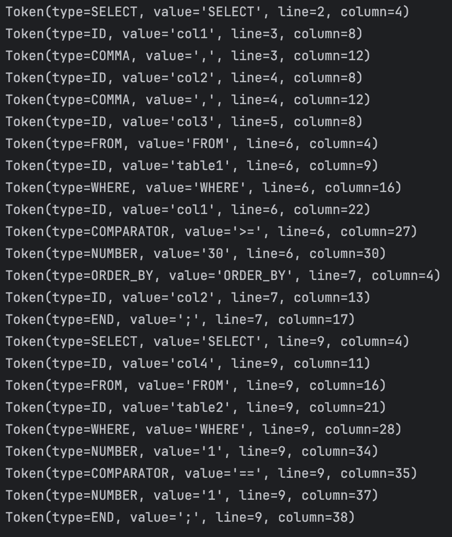

# Laboratory Work 3: Lexer & Scanner

### Course: Formal Languages & Finite Automata
### Author: Ciprian Moisenco

----

## Theory

### Lexical Analysis
Lexical analysis, or **tokenization**, is the process of converting a sequence of characters (e.g., source code) into meaningful units called **tokens**. It is the first step in compilation or interpretation, simplifying input for further processing.

### Lexer, Scanner, and Tokenizer
A **lexer** (or scanner/tokenizer) reads input character by character and groups them into tokens based on predefined rules. It:
1. Ignores whitespace and comments.
2. Identifies **lexemes** (sequences of characters matching language rules).
3. Generates **tokens** (symbolic representations of lexemes, e.g., `INTEGER_LITERAL`, `PLUS_OPERATOR`).

### Lexemes vs Tokens
- **Lexeme**: The actual character sequence (e.g., `42`).
- **Token**: The category of the lexeme (e.g., `INTEGER_LITERAL`).

### Example of Tokens
For the input `sin(3.14) + x * 2`, the lexer might produce:
1. `FUNCTION_NAME, "sin"`
2. `LEFT_PAREN, "("`
3. `FLOAT_LITERAL, "3.14"`
4. `RIGHT_PAREN, ")"`
5. `PLUS_OPERATOR, "+"`
6. `IDENTIFIER, "x"`
7. `MULTIPLY_OPERATOR, "*"`
8. `INTEGER_LITERAL, "2"`

### Role in Compilation
The lexer simplifies input into tokens, which are passed to the **parser** to build a syntax tree.

### Regular Expressions and Finite Automata
Lexers use **regular expressions** to define token patterns (e.g., `[0-9]+` for integers) and **finite automata** to recognize these patterns.

### Example: Lexer for a Calculator
A calculator lexer might recognize:
- Numbers: `42`, `3.14`
- Operators: `+`, `-`, `*`, `/`
- Functions: `sin`, `cos`
- Parentheses: `(`, `)`
- Identifiers: `x`, `y`

### Challenges
1. **Ambiguity**: Lexemes may match multiple patterns.
2. **Error Handling**: Invalid input must be handled gracefully.
3. **Efficiency**: Lexers must process input quickly.

## Objectives:
1. Understand what lexical analysis is.

2. Get familiar with the inner workings of a lexer/scanner/tokenizer.

3. Implement a sample lexer and show how it works.

## Implementation description

## Classes

### 1. `Token` Class.

The `Token` class represents a token generated by the lexer. It has an __init__ method that initializes a token with its type (kind), value, line number, and column position. Additionally, it includes a print_token method that prints the token in a readable format, displaying its type, value, line, and column.

```python
class Token:
    def __init__(self, kind, value, line, column):
        self.kind = kind
        self.value = value
        self.line = line
        self.column = column

    def print_token(self):
        print(f"Token(type={self.kind}, value='{self.value}', line={self.line}, column={self.column})")
```

### 2. `Lexer` Class

The `Lexer` class is responsible for tokenizing the input code. It is initialized with the input code through its __init__ method. The core functionality is implemented in the tokenize method, which performs lexical analysis. This method defines a set of keywords (e.g., `SELECT`, `FROM`) and token specifications (e.g., `NUMBER`, `ID`) using regular expressions. These specifications are combined into a single regex pattern to match tokens in the input code. The method iterates over the input using re.finditer, which yields match objects for each token found. For each match, the method determines the token type (kind) and value, converts numeric tokens to int or float, and handles keywords by checking if an identifier matches a predefined keyword. It skips whitespace and newlines, raises an error for unexpected characters, and creates a Token object for each valid token. The token is then appended to a list and printed using the print_token method. Finally, the method returns the list of tokens.

```python
class Lexer:
    def __init__(self, code):
        self.code = code

    def tokenize(self):
        code = self.code
        keywords = {"SELECT", "FROM", "WHERE", "ORDER_BY"}
        token_specification = [
            ('NUMBER', r'\d+(\.\d*)?'),  # Integer or decimal number
            ('ALL', r'\*'),  # All parameter
            ('COMPARATOR', r'(==|>=|<=|<>|>|<)'),  # Comparator operators
            ('COMMA', r','),  # Comma identifier
            ('END', r';'),  # Statement terminator
            ('ID', r'[a-zA-Z][a-zA-Z_$0-9]*'),  # Identifiers (fixed regex: `+` -> `*` to allow single-char IDs)
            ('NEWLINE', r'\n'),  # Line endings
            ('SKIP', r'[ \t]+'),  # Skip over spaces and tabs
            ('MISMATCH', r'.'),  # Any other character
        ]
        tok_regex = '|'.join(f'(?P<{kind}>{pattern})' for kind, pattern in token_specification)
        line_num = 1
        line_start = 0
        tokens = []

        for mo in re.finditer(tok_regex, code):
            kind = mo.lastgroup
            value = mo.group()
            column = mo.start() - line_start

            if kind == 'NUMBER':
                value = float(value) if '.' in value else int(value)
            elif kind == 'ID' and value in keywords:
                kind = value
            elif kind == 'NEWLINE':
                line_start = mo.end()
                line_num += 1
                continue
            elif kind == 'SKIP':
                continue
            elif kind == 'MISMATCH':
                raise RuntimeError(f'{value} unexpected on line {line_num}')

            token = Token(kind, value, line_num, column)
            tokens.append(token)
            token.print_token()  # Print token as required

        return tokens
```

### 3. `re.finditer` function

The `re.finditer` function is used to find all matches of the combined token regex in the input code. It returns an iterator of match objects, each representing a token. The `mo.lastgroup` property of the match object identifies the type of the last matched group (e.g., `NUMBER`, `ID`), while `mo.group()` retrieves the actual matched string. The mo.start() method provides the starting position of the match in the input string, which is used to calculate the column position of the token.
```python
           for mo in re.finditer(tok_regex, code):
            kind = mo.lastgroup
            value = mo.group()
            column = mo.start() - line_start

            if kind == 'NUMBER':
                value = float(value) if '.' in value else int(value)
            elif kind == 'ID' and value in keywords:
                kind = value
            elif kind == 'NEWLINE':
                line_start = mo.end()
                line_num += 1
                continue
            elif kind == 'SKIP':
                continue
            elif kind == 'MISMATCH':
                raise RuntimeError(f'{value} unexpected on line {line_num}')

            token = Token(kind, value, line_num, column)
            tokens.append(token)
            token.print_token()  # Print token as required
```


## Conclusion
This laboratory work focused on implementing a lexer to perform lexical analysis, breaking input code into meaningful tokens such as keywords, identifiers, numbers, and operators. Using regular expressions, the lexer efficiently processed the input, handled edge cases like whitespace and errors, and produced a stream of tokens for further processing. The lab reinforced the importance of lexical analysis as the first step in compilation, simplifying input for parsing and syntax tree construction. Through this practical exercise, we gained a deeper understanding of how lexers work and their role in language processing, laying a foundation for further exploration of compiler design and formal language theory.

### Results as code:
```python
Token(type=SELECT, value='SELECT', line=2, column=4)
Token(type=ID, value='col1', line=3, column=8)
Token(type=COMMA, value=',', line=3, column=12)
Token(type=ID, value='col2', line=4, column=8)
Token(type=COMMA, value=',', line=4, column=12)
Token(type=ID, value='col3', line=5, column=8)
Token(type=FROM, value='FROM', line=6, column=4)
Token(type=ID, value='table1', line=6, column=9)
Token(type=WHERE, value='WHERE', line=6, column=16)
Token(type=ID, value='col1', line=6, column=22)
Token(type=COMPARATOR, value='>=', line=6, column=27)
Token(type=NUMBER, value='30', line=6, column=30)
Token(type=ORDER_BY, value='ORDER_BY', line=7, column=4)
Token(type=ID, value='col2', line=7, column=13)
Token(type=END, value=';', line=7, column=17)
Token(type=SELECT, value='SELECT', line=9, column=4)
Token(type=ID, value='col4', line=9, column=11)
Token(type=FROM, value='FROM', line=9, column=16)
Token(type=ID, value='table2', line=9, column=21)
Token(type=WHERE, value='WHERE', line=9, column=28)
Token(type=NUMBER, value='1', line=9, column=34)
Token(type=COMPARATOR, value='==', line=9, column=35)
Token(type=NUMBER, value='1', line=9, column=37)
Token(type=END, value=';', line=9, column=38)
```
### Results as screenshot:


## References
1. COJUHARI Irina, DUCA Ludmila, FIODOROV Ion. "Formal Languages and Finite Automata: Guide for practical lessons". Technical University of Moldova.
2. Presentation "Regular Language. Finite Automata" - TUM - https://drive.google.com/file/d/1rBGyzDN5eWMXTNeUxLxmKsf7tyhHt9Jk/view