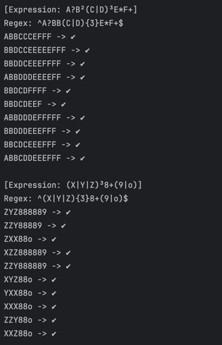
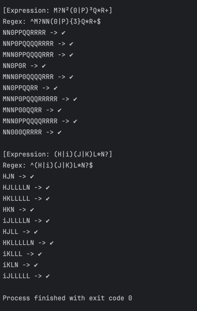

# Laboratory Work 4: Regular Expressions

### Course: Formal Languages & Finite Automata  
### Author: Ciprian Moisenco  

----

## Theory

Regular expressions (regex) are powerful patterns used to match and manipulate text strings. They form the basis of pattern matching in many programming languages and tools. A regular expression describes a set of strings without listing them explicitly, using special syntax to represent character classes, quantifiers, and operations.

Key components of regular expressions:
- **Literals**: Ordinary characters that match themselves
- **Character classes**: `[abc]` matches any of a, b, or c
- **Quantifiers**:
  - `?` - 0 or 1 occurrence
  - `*` - 0 or more occurrences
  - `+` - 1 or more occurrences
  - `{n}` - exactly n occurrences
- **Alternation**: `(a|b)` matches either a or b
- **Grouping**: `()` creates capture groups
- **Anchors**: `^` (start of string) and `$` (end of string)

Regular expressions are widely used for:
- Input validation
- String searching and manipulation
- Lexical analysis in compilers
- Text processing and data extraction
- Syntax highlighting

## Objectives:
1. Understand and implement regular expression generators
2. For each given regular expression:
   a. Dynamically generate valid strings
   b. Limit repetitions to 5 for practical output
   c. (Bonus) Show the processing sequence

## Implementation Description

### CustomRegexParser Class
The `CustomRegexParser` class serves as the foundation for interpreting a compact regex syntax that extends standard regular expressions with shorthand notations. Its primary role is to translate user-friendly patterns into Python’s native `re`-compatible format.

Key features:
- Superscript Repetition: Converts shorthand like `A²` or `B³` into `AA` or `BBB`, respectively, using a lookup map (`superscript_map`).
- Group Processing: Manages alternations within parentheses (e.g., `(X|Y)`) and applies repetition quantifiers to entire groups if followed by a superscript.
- Quantifier Support: Handles standard regex operators (`?, *, +`) without modification, ensuring compatibility.
- Anchoring: Wraps the final pattern in `^...$` to enforce full-string matching.

```python
class CustomRegexParser:
    def __init__(self):
        self.superscript_map = {'²': 2, '³': 3}

    def parse(self, expression):
        result = ''
        i = 0
        while i < len(expression):
            char = expression[i]
            # Handle superscript repetition
            if i + 1 < len(expression) and expression[i + 1] in self.superscript_map:
                repeat = self.superscript_map[expression[i + 1]]
                result += char * repeat
                i += 2
            # Handle groups
            elif char == '(':
                end = expression.find(')', i)
                group = expression[i:end + 1]
                repeat = ''
                if end + 1 < len(expression) and expression[end + 1] in self.superscript_map:
                    repeat = '{' + str(self.superscript_map[expression[end + 1]]) + '}'
                    i = end + 2
                else:
                    i = end + 1
                result += group + repeat
            # Handle standard quantifiers
            elif i + 1 < len(expression) and expression[i + 1] in '?*+':
                result += char + expression[i + 1]
                i += 2
            else:
                result += char
                i += 1
        return f'^{result}$'
```

### RegexInterpreter Class
The `RegexInterpreter` acts as a bridge between the custom syntax and Python’s regex engine. It leverages `CustomRegexParser` to validate strings against user-defined patterns.

Workflow:
- Parse: Converts the custom expression (e.g., `M?N²(0|P)³Q*R+`) to a standard regex.
- Match: Uses re.match() to check if the input string (e.g., `MN0PQQRR`) fully adheres to the pattern.
- Return: Returns a boolean (`True`/`✔` for valid matches, `False`/`✘` otherwise).

Edge Cases Handled:
- Empty strings (invalid for patterns requiring mandatory characters like `+`).
- Partial matches (rejected due to anchoring with `^...$`).

```python
class RegexInterpreter:
    def __init__(self):
        self.parser = CustomRegexParser()

    def interpret(self, string, expression):
        regex = self.parser.parse(expression)
        return re.match(regex, string) is not None
```

### Generator Class
The `Generator` class dynamically produces strings that conform to the custom regex patterns, enabling testing and exploration.

Algorithmic Approach:

1. Random Expansion:
   - For `?`: Randomly includes the preceding character (50% probability). 
   - For `*/+`: Generates 0–5 or 1–5 repetitions, respectively (configurable). 
   - For superscripts (e.g., `²`): Repeats the character exactly 2 times.

2. Group Handling:
   - Splits options in `(A|B|C)` and selects one randomly. If followed by a superscript (e.g., `³`), repeats the selection three times.

3. Uniqueness Guarantee:
   - Generates `3 * count` samples, then filters duplicates via `set()` before returning the first `count` entries.

Example Output for `(X|Y|Z)³8+(9|o)`:
- `XYZ888o` (3 random choices from `X/Y/Z`, three `8`s, ends with `o`).
- `"YYY89`" (all `Y`, two `8`s, ends with `9`).

Controlled Randomness:
The use of `random.choice()` and `random.randint()` ensures variability while adhering to regex constraints. Repetition limits (e.g., 5 for `*/+`) prevent excessively long strings.

```python
class Generator:
    def __init__(self):
        self.superscript_map = {'²': 2, '³': 3}

    def generate_regex(self, expression, count=10):
        samples = []
        for _ in range(count * 3):
            result = ''
            i = 0
            while i < len(expression):
                char = expression[i]

                if i + 1 < len(expression) and expression[i + 1] in '?*+':
                    q = expression[i + 1]
                    if q == '?':
                        result += random.choice([char, ''])
                    elif q == '*':
                        result += char * random.randint(0, 5)
                    elif q == '+':
                        result += char * random.randint(1, 5)
                    i += 2

                elif i + 1 < len(expression) and expression[i + 1] in self.superscript_map:
                    result += char * self.superscript_map[expression[i + 1]]
                    i += 2

                elif char == '(':
                    end = expression.find(')', i)
                    group_content = expression[i + 1:end]
                    options = group_content.split('|')
                    chosen = random.choice(options)
                    if end + 1 < len(expression) and expression[end + 1] in self.superscript_map:
                        repeat = self.superscript_map[expression[end + 1]]
                        result += ''.join(random.choices(options, k=repeat))
                        i = end + 2
                    else:
                        result += chosen
                        i = end + 1

                else:
                    result += char
                    i += 1

            samples.append(result)
        return list(set(samples))
```

## Results as code:
```python
[Expression: A?B²(C|D)³E*F+]
Regex: ^A?BB(C|D){3}E*F+$
ABBCCCEFFF -> ✔
BBDCCEEEEEFFF -> ✔
BBDDCEEEFFFF -> ✔
ABBDDDEEEEFF -> ✔
BBDCDFFFF -> ✔
BBDCDEEF -> ✔
ABBDDDEFFFFF -> ✔
BBDDDEEEFFF -> ✔
BBCDCEEEFFF -> ✔
ABBCDDEEEFFF -> ✔

[Expression: (X|Y|Z)³8+(9|o)]
Regex: ^(X|Y|Z){3}8+(9|o)$
ZYZ888889 -> ✔
ZZY88889 -> ✔
ZXX88o -> ✔
XZZ888889 -> ✔
ZZY888889 -> ✔
XYZ88o -> ✔
YXX88o -> ✔
XXX88o -> ✔
ZZY88o -> ✔
XXZ88o -> ✔

[Expression: M?N²(0|P)³Q*R+]
Regex: ^M?NN(0|P){3}Q*R+$
NN0PPQQRRRR -> ✔
NNP0PQQQQRRRR -> ✔
MNN0PPQQQQRRR -> ✔
NN0P0R -> ✔
MNN0P0QQQQRRR -> ✔
NN0PPQQRR -> ✔
MNNP0PQQQRRRRR -> ✔
MNNP00QQRR -> ✔
MNN0PPQQQQRRRR -> ✔
NN000QRRRR -> ✔

[Expression: (H|i)(J|K)L*N?]
Regex: ^(H|i)(J|K)L*N?$
HJN -> ✔
HJLLLLN -> ✔
HKLLLLL -> ✔
HKN -> ✔
iJLLLLN -> ✔
HJLL -> ✔
HKLLLLLN -> ✔
iKLLL -> ✔
iKLN -> ✔
iJLLLLL -> ✔

Process finished with exit code 0
```

## Results as screenshot:



## Conclusion
In conclusion, the regular expression generator successfully creates strings that match specific patterns defined by regular expressions. 
Each method in the `Generator class` handles different regex patterns, using loops and the `random` module to generate combinations of characters 
that satisfy the given quantifiers. This implementation demonstrates a practical approach to understanding and working with regular expressions, 
showcasing how they can be used for generating varied string patterns. The helper function `print_examples` ensures that the results are displayed 
clearly and in a randomized manner, making the output easy to analyze. Through this project, we gain deeper insight into how regular expressions 
work and how they can be applied programmatically. This tool can be further extended or adapted for other regex-based tasks in various fields, 
such as data validation and text processing.

## References
1. COJUHARI Irina, DUCA Ludmila, FIODOROV Ion. "Formal Languages and Finite Automata: Guide for practical lessons". Technical University of Moldova.
2. Presentation "Regular Language. Finite Automata" - TUM - https://drive.google.com/file/d/1rBGyzDN5eWMXTNeUxLxmKsf7tyhHt9Jk/view