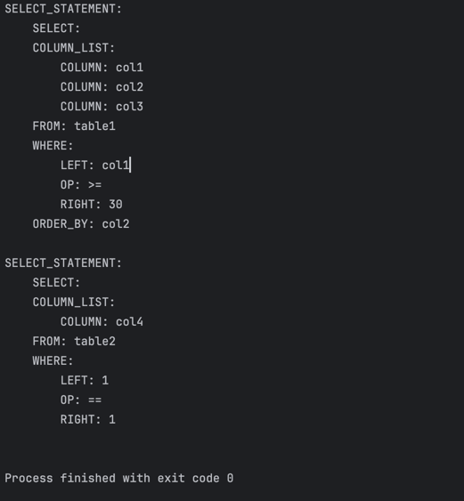
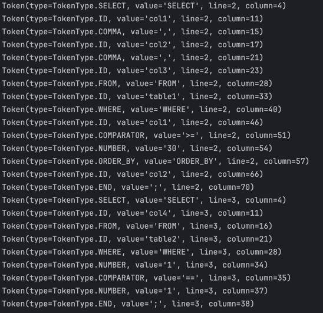

# Laboratory Work 6: Parser & AST Construction

### Course: Formal Languages & Finite Automata  
### Author: Ciprian Moisenco

----

## Theory

### Parsing
Parsing is the process of analyzing a sequence of input tokens to determine its grammatical structure according to a given formal grammar. A parser's output typically consists of a parse tree or an abstract syntax tree (AST), which provides a structured and hierarchical representation of the source input. This stage of compilation or interpretation comes after lexical analysis (tokenization) and is responsible for ensuring that the syntax of the source code is valid.

Parsers can be classified as:
- **Top-down parsers**: e.g., Recursive Descent, LL parsers
- **Bottom-up parsers**: e.g., LR, SLR, LALR parsers

In this laboratory, we used a **recursive descent parser**, a type of top-down parser that consists of a set of mutually recursive procedures.

### Abstract Syntax Tree (AST)
An Abstract Syntax Tree is a simplified, tree-based representation of the structure of source code. Unlike a parse tree, which captures every syntactic rule, the AST omits unnecessary syntax and focuses on the logical and hierarchical relationships among code components. Each node in an AST represents a construct occurring in the source code.

Advantages of using ASTs:
- Makes semantic analysis easier (type checking, scope resolution)
- Facilitates code generation and optimization
- Enables code transformation and interpretation

### Lexical Analysis (Context Recap)
Lexical analysis is the first phase of compilation. It transforms raw source code into a sequence of tokens using regular expressions. Tokens can represent identifiers, keywords, numbers, symbols, etc. These tokens are then fed into the parser.

A lexer must:
- Ignore whitespace and comments
- Detect keywords and identifiers
- Identify numeric and symbolic literals
- Raise errors on unrecognized input

Regular expressions and finite automata are commonly used to build lexers.

### SQL Subset for Parsing
The parser built in this lab supports a limited subset of SQL with the following grammar:
```
statement := SELECT column_list FROM ID [WHERE expression] [ORDER_BY ID] ;
column_list := ID [, ID]*
expression := (ID | NUMBER) COMPARATOR (ID | NUMBER)
```

---

## Objectives
1. Understand parsing and how it can be programmed.
2. Get familiar with the concept of Abstract Syntax Trees.
3. Add the following features:
   - Implement a TokenType enum to categorize tokens.
   - Use regular expressions for lexical analysis.
   - Build data structures for representing ASTs.
   - Implement a parser that builds ASTs from token sequences.

---

## Implementation Description

### TokenType Enum
Defines symbolic names for all possible token types. Used in both the lexer and parser for comparison and branching logic.
```python
from enum import Enum

class TokenType(Enum):
    NUMBER = 'NUMBER'
    ALL = 'ALL'
    COMPARATOR = 'COMPARATOR'
    COMMA = 'COMMA'
    END = 'END'
    ID = 'ID'
    SELECT = 'SELECT'
    FROM = 'FROM'
    WHERE = 'WHERE'
    ORDER_BY = 'ORDER_BY'
```

### Token Class
Represents a single token with its type, value, and position (line and column).
```python
class Token:
    def __init__(self, kind, value, line, column):
        self.kind = kind
        self.value = value
        self.line = line
        self.column = column

    def print_token(self):
        print(f"Token(type={self.kind}, value='{self.value}', line={self.line}, column={self.column})")
```

### Lexer Class
**Purpose:** Converts raw source code into a list of Token objects using regular expressions.

**Key Function:** `tokenize()`
- Defines token patterns via regex.
- Iterates over the code using `re.finditer()`.
- Matches patterns and converts them into Token objects.
- Ignores whitespace and raises errors on unrecognized tokens.

```python
def tokenize(self):
    # Setup and pattern compilation
    tok_regex = '|'.join(f'(?P<{kind}>{pattern})' for kind, pattern in token_specification)
    for mo in re.finditer(tok_regex, code):
        ...
        if kind == 'NUMBER':
            value = float(value) if '.' in value else int(value)
        elif kind == 'ID' and value in keywords:
            kind = value
        elif kind == 'MISMATCH':
            raise RuntimeError(f'{value} unexpected on line {line_num}')
        ...
        tokens.append(Token(kind_enum, value, line_num, column))
```

### ASTNode Class
**Purpose:** Represents a node in the Abstract Syntax Tree.

**Functions:**
- `add_child(node)`: Appends a child node
- `__str__()`: Recursively prints the tree in readable format

```python
class ASTNode:
    def __init__(self, kind, value=None, children=None):
        self.kind = kind
        self.value = value
        self.children = children or []

    def add_child(self, node):
        self.children.append(node)

    def __str__(self, level=0):
        ret = "\t" * level + f"{self.kind}: {self.value if self.value else ''}\n"
        for child in self.children:
            ret += child.__str__(level + 1)
        return ret
```

### Parser Class
**Purpose:** Parses token list into ASTs using recursive descent logic.

**Core Functions:**

- `parse()` — Initiates parsing for each statement in the token list.
- `expect(*types)` — Ensures the next token matches expected types.
- `match(*types)` — Tries to consume a token if it matches.
- `select_statement()` — Parses `SELECT` clause, columns, FROM, WHERE, and ORDER_BY if present.

```python
def select_statement(self):
    node = ASTNode('SELECT_STATEMENT')
    self.expect(TokenType.SELECT)
    ...
    if self.match(TokenType.WHERE):
        where = ASTNode('WHERE')
        left = self.expect(TokenType.ID, TokenType.NUMBER)
        comp = self.expect(TokenType.COMPARATOR)
        right = self.expect(TokenType.ID, TokenType.NUMBER)
        ...
    return node
```

---

## Results

### Console Token Output
```python
Token(type=TokenType.SELECT, value='SELECT', line=2, column=4)
Token(type=TokenType.ID, value='col1', line=2, column=11)
Token(type=TokenType.COMMA, value=',', line=2, column=15)
Token(type=TokenType.ID, value='col2', line=2, column=17)
Token(type=TokenType.COMMA, value=',', line=2, column=21)
Token(type=TokenType.ID, value='col3', line=2, column=23)
Token(type=TokenType.FROM, value='FROM', line=2, column=28)
Token(type=TokenType.ID, value='table1', line=2, column=33)
Token(type=TokenType.WHERE, value='WHERE', line=2, column=40)
Token(type=TokenType.ID, value='col1', line=2, column=46)
Token(type=TokenType.COMPARATOR, value='>=', line=2, column=51)
Token(type=TokenType.NUMBER, value='30', line=2, column=54)
Token(type=TokenType.ORDER_BY, value='ORDER_BY', line=2, column=57)
Token(type=TokenType.ID, value='col2', line=2, column=66)
Token(type=TokenType.END, value=';', line=2, column=70)
Token(type=TokenType.SELECT, value='SELECT', line=3, column=4)
Token(type=TokenType.ID, value='col4', line=3, column=11)
Token(type=TokenType.FROM, value='FROM', line=3, column=16)
Token(type=TokenType.ID, value='table2', line=3, column=21)
Token(type=TokenType.WHERE, value='WHERE', line=3, column=28)
Token(type=TokenType.NUMBER, value='1', line=3, column=34)
Token(type=TokenType.COMPARATOR, value='==', line=3, column=35)
Token(type=TokenType.NUMBER, value='1', line=3, column=37)
Token(type=TokenType.END, value=';', line=3, column=38)
```

### AST Output
```
SELECT_STATEMENT:
    SELECT:
    COLUMN_LIST:
        COLUMN: col1
        COLUMN: col2
        COLUMN: col3
    FROM: table1
    WHERE:
        LEFT: col1
        OP: >=
        RIGHT: 30
    ORDER_BY: col2

SELECT_STATEMENT:
    SELECT:
    COLUMN_LIST:
        COLUMN: col4
    FROM: table2
    WHERE:
        LEFT: 1
        OP: ==
        RIGHT: 1
```

### Screenshot
<div style="display: flex; justify-content: space-around; align-items: center;">
    
    
</div>

---

## Conclusion
This laboratory work successfully demonstrated the core principles of parsing and AST construction. We extended the lexer from the previous lab to produce structured tokens and then implemented a recursive descent parser to build an AST from those tokens. Through this, we gained practical experience in structuring source code syntactically, detecting valid SQL-like statements, and organizing logic hierarchically. 

By carefully designing an enum-based token type system, using regular expressions for lexing, and implementing the parser functions for grammar constructs, we completed the cycle from raw source input to a structured, abstract representation. This hands-on experience builds a strong foundation for future compiler construction topics such as semantic analysis, code generation, and optimization.

## References
1. COJUHARI Irina, DUCA Ludmila, FIODOROV Ion. "Formal Languages and Finite Automata: Guide for practical lessons". Technical University of Moldova.
